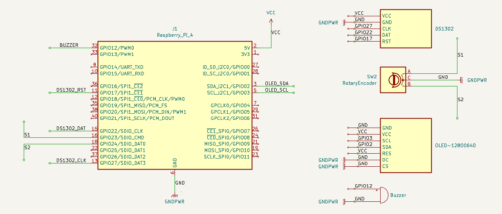

# 🔐 금고 비밀번호를 찾아라  
### Linux Device Driver 기반 금고 해제 & 실시간 시계 시스템

> Intel Edge SW Academy Project  
> Raspberry Pi 4 기반 리눅스 커널 디바이스 드라이버 설계 및 응용

---

## 👤 팀 구성

- **김기환** : 애플리케이션 로직, UI 구성 및 테스트  
- **이동현** : 디바이스 드라이버 설계, 입력 안정성 개선, 시스템 구조 설계  

---

## 프로젝트 요약

본 프로젝트는 **리눅스 디바이스 드라이버를 직접 구현**하여 금고 해제 게임과 실시간 시계 기능을 제공하는 임베디드 시스템입니다.

OLED 디스플레이 기반 UI와 로터리 엔코더 입력을 활용해 직관적인 메뉴 조작과 실시간 피드백을 구현했으며, RTC/PWM/GPIO/I2C 등 핵심 임베디드 요소를 커널 레벨에서 제어했습니다.

---

## 핵심 목표 및 구현 범위

- 리눅스 디바이스 드라이버 기반 입력/출력 제어
- 로터리 엔코더 노이즈 없는 고신뢰 입력 처리
- 비동기 UI 갱신 및 실시간 피드백 시스템
- 게임 로직과 시스템 설정의 상태(State) 기반 설계

---

## 하드웨어

<table>
  <tr>
    <th align="center">Hardware</th>
    <th align="center">KiCad</th>
  </tr>
  <tr>
    <td align="center">
      
    </td>
    <td align="center">
      
    </td>
  </tr>
</table>

---

## 시스템 구조

**User** ↔ **Application(Logic/UI)** ↔ **Device Driver(Kernel)** ↔ **Hardware(OLED/Rotary/RTC/Buzzer)**

## Flow CHart

---

## 동작 화면

### ▶ 금고 해제 게임 (START_GAME)

### ▶ 시간 설정 모드 (TIME_SETTING)

---

## 🔧 디바이스 드라이버 구성

| Driver | 주요 역할 |
|------|---------|
| Rotary Driver | 로터리 회전 / 버튼 입력 처리 |
| OLED Driver | I2C 기반 UI 출력 |
| RTC Driver | 시간 조회 및 설정 |
| Buzzer Driver | PWM 기반 힌트 및 알림 |

---

## 🧪 오실로스코프 분석 (입력 안정성 검증)

### ▶ 로터리 엔코더 파형 분석  
- 회전 방향(CW / CCW) 및 버튼 입력 파형 확인  

---

### ▶ PWM 부저 파형 분석
- 주기 변화에 따른 출력 파형 확인  

---

## Trouble SHooting

- **로터리 입력 튐 현상**

  - 인터럽트 방식 → 노이즈에 취약
  - **hrtimer 기반 1ms 폴링 방식으로 전환**
  - 입력 안정성 및 예측 가능한 CPU 부하 확보

- **OLED 출력 지연**
  - I2C 전송 구조 개선
  - UI 반응성 향상